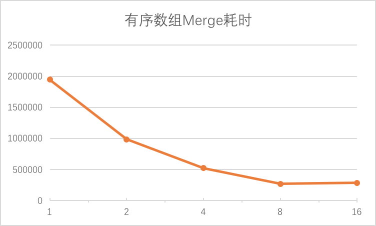
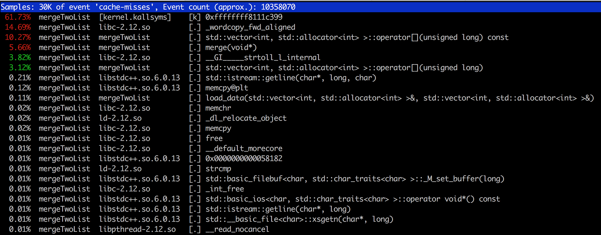

## 多线程Merge性能统计
### 测试机器
```
CPU 8核，2.60GHz，宿主机，KVM虚拟化

```

```
一个进程merge耗时   1944901  微秒
两个线程merge耗时   984138   微秒  相对单进程提高49%  
四个线程merge耗时   521818   微秒  相对单进程提高73%  
八个线程merge耗时   268360   微秒  相对单进程提高86%  
十六个线程merge耗时 281368   微秒  相对八进程降低4.8%  

```
图表为：



### 一些性能注意点：
merge函数里的value要使用resize，并且覆盖值，否则会引起Cache False Sharing问题，因为vector size是局部变量，每次插入都需要更新，导致多线程性能很差，甚至不如单线程性能高。

### perf report
